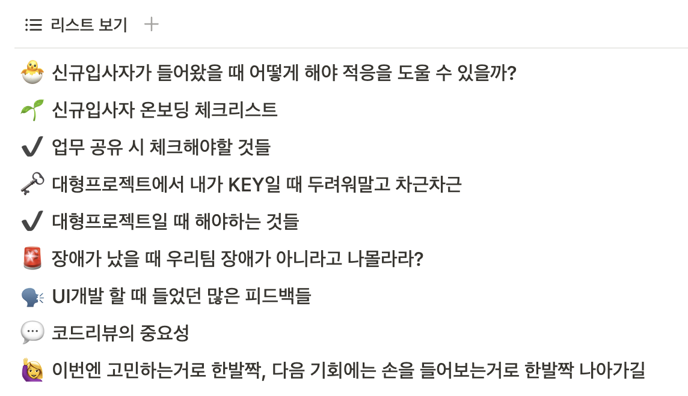

  

<h2 align="center">👩🏻‍💻 [TMON] Front-End Working Record ✍🏻</h2>

티몬 프론트엔드 개발 업무에서 중요했던 내용들을 기록합니다.

 

### [👩🏻‍💻 메인으로 진행했던 프로젝트 이야기](https://github.com/mireyhgnay/fe-working-record/tree/main/Projects)

  
무슨 프로젝트를 했나~ 열어서 확인해보기

#### [📁 Monorepo 이관 및 셋팅 👉](https://github.com/mireyhgnay/fe-monorepo)

#### [🖥️ 티몬 메인 홈 브라우저 성능 개선 👉](https://github.com/mireyhgnay/browser-performance-upgrade)

#### [🎨 티몬 서비스 공통 컴포넌트 디자인 개편 👉](https://hyerimiya.notion.site/5975ea18cc0b46a0b6aab69af82027a6?pvs=4)

### [📝 업무하면서 중요하다 생각되는 것들과 공부한 내용들](https://github.com/mireyhgnay/fe-working-record/blob/main/Study/README.md)

### [🚨 업무하면서 만난 Error들](https://github.com/mireyhgnay/fe-working-record/blob/main/Error/README.md)

### [🙏 업무하면서 참 중요하다고 생각했던 것들, 배우게 된 것들 모아모아](https://hyerimiya.notion.site/ab02ec2b977843ca9d7f801733f727a6?v=dfaf67d1c96247a4bf76f570291ecd8e&pvs=4)

  
현재 비공개 상태이지만, 어떤 내용이 있을까?

  

